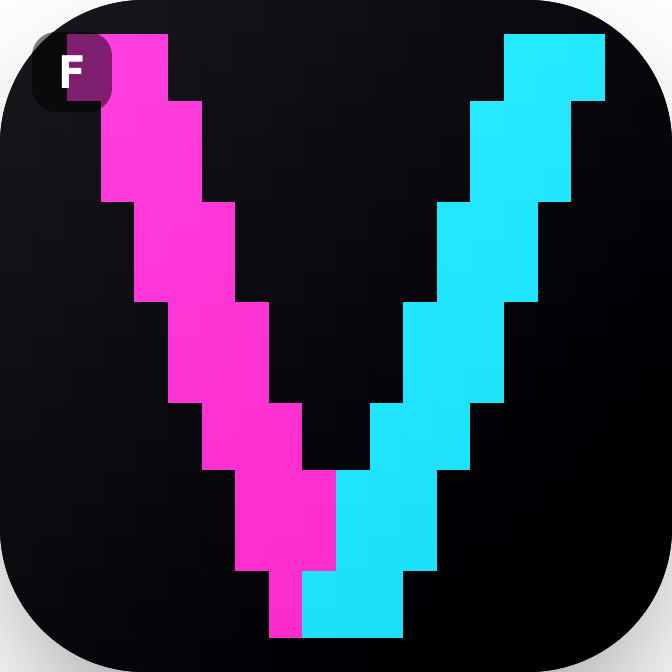

<p align="center">
  
</p>

<h1 align="center">VelocityUI</h1>

[](https://www.swift.org)
[](https://developer.apple.com/ios/)
[](https://www.swift.org/package-manager/)
[](LICENSE)
[](#versioning)

**High-performance scrolling feeds, grids, and streaming rich text for iOS — built in Swift 6.**

> *Texture rebuilt from scratch with Swift 6, async/await, structured concurrency, and a
> SwiftUI-syntax DSL — with none of SwiftUI's rendering pipeline in the hot path.*

VelocityUI is a Swift Package for building buttery feeds and grids that mix images, GIFs, and
video, plus **streaming Markdown** (headings, code, tables, math) that repaints token-by-token
without dropping frames. The scroll path never touches the main-actor async machinery, layout
runs off the main thread, and every cell is a pooled `CALayer` — no `UICollectionView`, no
`UIView`-per-cell, no `CATextLayer`.

> **Status: early beta (`0.4.0`).** The engine works end-to-end and is exercised by 130+
> tests, but the public API is still moving and features land branch by branch. Not yet
> recommended for production. See [Versioning](#versioning) below.

---

## Quick start

### Install

Add VelocityUI as a Swift Package dependency:

```swift
// Package.swift
dependencies: [
    .package(url: "https://github.com/v60lover/VelocityUI.git", from: "0.4.0")
]
```

Or in Xcode: **File → Add Package Dependencies…** and paste the repo URL.

### A minimal feed

A feed needs three things: your data (`Identifiable & Sendable & Equatable`), a
`RenderEnvironment` (the composition root — construct it **once** and reuse it), and a cell
builder that returns a `RenderView`.

```swift
import SwiftUI
import VelocityUI

struct Post: Identifiable, Sendable, Equatable {
    let id: UUID
    let imageURL: URL
    let caption: String
}

// A cell is a RenderView: it describes one item as a tree of render nodes.
struct PostCell: RenderView {
    let post: Post

    var renderBody: some RenderNode {
        VStackNode(alignment: .leading, spacing: 8) {
            AsyncImageNode(url: post.imageURL, aspectRatio: 4.0 / 3.0)
            TextNode(post.caption, font: .body)
        }
    }
}

struct FeedScreen: View {
    let posts: [Post]

    // Build the environment once — it owns every cache, actor, and pool for this feed.
    @State private var env = RenderEnvironment()

    var body: some View {
        AsyncFeed(items: posts, environment: env) { post in
            PostCell(post: post)
        }
        .prefetchScreens(leading: 2, trailing: 1)   // warm 2 screens ahead, 1 behind
        .onTap { post, _ in print("tapped \(post.id)") }
        .ignoresSafeArea()
    }
}
```

`AsyncFeed` is a `UIViewRepresentable`, so it drops straight into any SwiftUI hierarchy. The
default layout is a single vertical column (`.vertical()`); pass a `GridLayout` for multi-column
grids.

### Streaming Markdown (LLM chat)

For a live-updating transcript, feed tokens into an `IncrementalMarkdownParser` and hand its
`renderNodes` to a cell. Sealed blocks are cached as bitmaps; only the open "hot" block
re-rasterizes per token.

```swift
struct MessageCell: RenderView {
    let parser: IncrementalMarkdownParser   // fed with streamed tokens

    var renderBody: some RenderNode {
        VStackNode(alignment: .leading, spacing: 8) {
            parser.renderNodes(theme: .default)
        }
    }
}
```

> The high-level `StreamingChatFeed` surface (bubbles, roles, auto-scroll) is
> [in progress](#streaming-llm-style-chat--work-in-progress) — for now you wire the parser into
> a cell yourself.

---

## Why it exists

No existing library combines all of these at once:

1. A SwiftUI-style declarative developer API
2. Parallel, off-main layout (pure functions fanned out over a `TaskGroup`)
3. `CALayer`-direct rendering (no `UICollectionView`, no `UIView` per cell)
4. An async media pipeline for images, GIFs, and video
5. React-inspired structural diffing
6. Swift 6 strict concurrency, top to bottom
7. A **synchronous** scroll fast-path with zero async hops

| Alternative | Where it falls short |
|---|---|
| Texture / AsyncDisplayKit | ObjC++ core, no Swift Concurrency, effectively unmaintained |
| SwiftUI native | All `body` eval, layout, and text sizing on `@MainActor` |
| `UICollectionView` + `UIHostingConfiguration` | Still runs the SwiftUI view graph per cell |
| Airbnb Epoxy | Declarative wrapper only — no async layout engine, no media pipeline |

---

## Optimizations

These are the decisions that keep frames on time:

- **Zero-async scroll path.** `updateVisibleCells` is fully synchronous — no `await`, no `Task`
  spawn while the finger is down. Layout is already resolved before scrolling reaches a cell.
- **Off-main parallel layout.** `measureNode` is a `nonisolated` pure function; the pipeline
  fans measurement out across the cooperative pool with a `TaskGroup`, so text sizing never
  blocks the main actor.
- **Ring-buffer working range.** Resolved layouts live in a contiguous ring buffer, giving
  `O(1)` lookup during scroll — never a `[Int: Layout]` dictionary.
- **Text rendered to bitmaps, never `CATextLayer`.** Text is laid out with `NSTextLayoutManager`
  (TextKit 2), rasterized to a `CGImage`, and set as plain `CALayer.contents`. Measurement and
  render agree to within 1pt.
- **Rounding at decode time.** No `cornerRadius` / `masksToBounds` on the hot path — corners are
  clipped into the bitmap in a `CGContext` when the image is decoded.
- **Uniform pixel format.** Every image is normalised to BGRA8888 premultiplied at decode time,
  so the compositor never converts on the main thread.
- **Isolated decode.** Media decoding runs on bounded, custom `DispatchQueue`-backed executors,
  kept off Swift's cooperative pool so a burst of decodes can't starve layout.
- **Allocation-free structural diff** with a three-tier classifier (identity / layout / media),
  so a scroll or a content edit only re-does the work that actually changed.
- **Streaming raster cache.** For live-updating Markdown, sealed blocks are frozen to bitmap
  tiles and only the "hot" tail block is re-measured and re-rasterized per token (see below).

Hard size/structure rules (400-line file cap, no test hooks in production types, one
responsibility per extension file) are documented in `ARCHITECTURE-RULES.md` and machine-checked
by `scripts/check-architecture.sh` in CI.

---

## Streaming, LLM-style chat — work in progress

The flagship target is a **ChatGPT-style streaming chat transcript**: Markdown that arrives a
few tokens at a time, repainting live, with code, tables, and math — all on the same
zero-async, CALayer-backed engine as the feed. Most of the hard rendering primitives are already
in place; the remaining work is wiring them into a turnkey chat surface.

### Done

- **Incremental Markdown parser** that seals finished blocks and keeps a single "hot" open block,
  validated against `swift-markdown` (cmark-gfm) as a differential parse oracle in tests.
- **Streaming text rasterization** — sealed blocks freeze to bitmap tiles; only the hot tail
  block is re-measured and re-drawn per token, so a long transcript doesn't re-layout on every
  chunk.
- **Streaming code blocks** with tree-sitter syntax highlighting (Swift, JavaScript, Python,
  JSON, Bash), delivered as two `CALayer`s (a sealed body + a live tail) and chunked so partial
  lines don't flicker.
- **Horizontal code-block scrolling** with `UIScrollView`-like momentum and edge spring — pure
  CALayer, no nested scroll view.
- **GitHub-flavored Markdown tables** — consecutive rows grouped into one table block, with a
  column-width solver.
- **LaTeX math** via a vendored, pure-Swift KaTeX-style engine ([SwaTex](#third-party)) that
  draws straight to `CGImage` — no `UIView` in the path.

### Planned

- A high-level `StreamingChatFeed` DSL surface (bubble layout, roles, auto-scroll-to-bottom,
  "stop / regenerate" affordances).
- More tree-sitter grammars (SQL is deferred on a toolchain issue; C/Rust/Go/TypeScript next).
- Inline Markdown links, images, and blockquotes styled to parity.
- Math display-mode block layout and baseline alignment inside running text.
- Accessibility pass for streaming content (VoiceOver on a mutating transcript).
- Public API stabilization and documentation before a `0.5`/`1.0` line.

---

## Inspiration & prior art

- **Texture / AsyncDisplayKit** — the north star for async, off-main layout and node-based
  rendering. VelocityUI is the "what if we rebuilt this idea in modern Swift" answer.
- **React** — structural diffing and the description/reconciliation split.
- **Jetpack Compose** — clean separation of *describe* vs *measure* vs *render*.
- **Pinterest / Netflix** feed engineering — media-pipeline patterns (working ranges, decode
  prioritization, placeholder-first paint).
- **Nuke / FLAnimatedImage** — image decoding and GIF playback design.
- **KaTeX** (via **RaTeX** and **SwaTex**) — math typesetting layout and metrics.

---

## Requirements

- iOS 17.0+ (`View` is `@MainActor`-isolated on 17; ~93% device coverage in 2026)
- Swift 6 / Xcode 16+
- Swift Package Manager (no CocoaPods)

See [Quick start](#quick-start) for the install snippet and a runnable example.

---

## Versioning

Current estimate: **`0.4.0`.**

Why pre-1.0 and why beta:

- The four-layer engine, grid layout, media pipeline, and the streaming Markdown/code/math/table
  stack all work end-to-end and are covered by 130+ tests — this is well past an alpha or a
  proof of concept.
- But the public DSL is still changing between branches, the streaming-chat surface isn't wired
  yet, and several planned features (grammars, links, accessibility) are open. That's squarely
  `0.x`, and the honest label is **beta**, not release-candidate.

The version moves to `0.5` when the `StreamingChatFeed` surface lands, and toward `1.0` when the
public API is frozen and documented.

Release notes live in [`CHANGELOG.md`](CHANGELOG.md). The current version is also readable at
runtime via `VelocityUIVersion.current`. On each release, keep three things in sync: the git tag,
`VelocityUIVersion.current`, and the `CHANGELOG.md` heading.

---

## License

Licensed under the **Apache License 2.0** — see [`LICENSE`](LICENSE) and [`NOTICE`](NOTICE).

It's free and permissive: you can use, modify, and ship VelocityUI in commercial and closed-
source apps. What it asks in return is attribution — keep the license and the `NOTICE` file with
the source, and preserve the copyright/notice headers. Apache-2.0 also grants patent rights,
which is why it's the common choice for serious Swift/iOS libraries.

A note on expectations: no standard permissive license can *force* a visible in-app credit
(the old BSD "advertising clause" tried and is now discouraged). If you'd like to credit
VelocityUI somewhere users can see it, that's genuinely appreciated — but it's a request in this
README, not a legal requirement.

This is compatible with everything VelocityUI depends on or vendors (all MIT or Apache-2.0).

<a name="third-party"></a>
### Third-party code

VelocityUI vendors and depends on permissively licensed work — see `THIRD_PARTY_NOTICES.md` for
the full list and local patches. Highlights:

- **SwaTex** (MIT) — pure-Swift LaTeX engine; itself derives from **RaTeX** (MIT) and **KaTeX**
  (MIT + SIL OFL 1.1 fonts).
- **tree-sitter** grammars (MIT/Apache-2.0) — syntax highlighting.
- **swift-markdown** (Apache-2.0) — used **only** as a test-time parse oracle, never shipped in
  the library.
